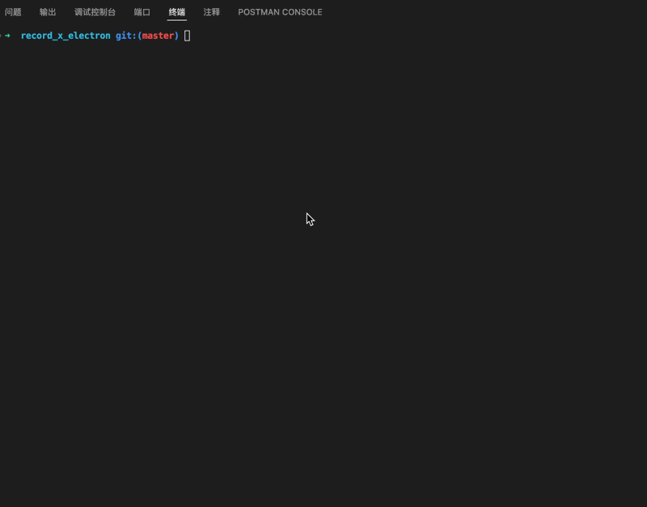

<h1>
  <p align='center'>
    File-check-used
  </p>
</h1>

<p align='center'>
  <a href="https://github.com/weipengzou/file-check-used/blob/main/README.md" target="_blank">English</a>
  <span>|</span>
  <a href="https://github.com/weipengzou/file-check-used/blob/main/docs/README.zh_CN.md" target="_blank">中文</a>
</p>

A tool for detecting unused code in projects.

support

- Resource materials
- constant
- TS type declaration (support Automatically remove)

Remove unused assets and reduce the size of the project package.
Millisecond-level speed, zero intrusion into the project, and a size of only 3KB.

<p align='center'>
  
  
  
</p>

## Demo



## Install

```shell
npm i -g file-check-used
```

## Usage

Use the `fcu` command in the project root directory after the global installation.

```shell
$ fcu
```

## License

MIT
